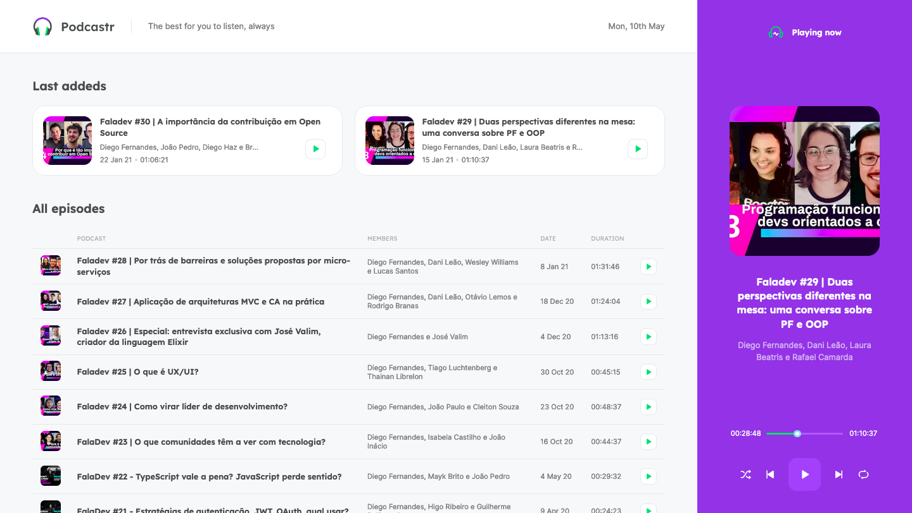
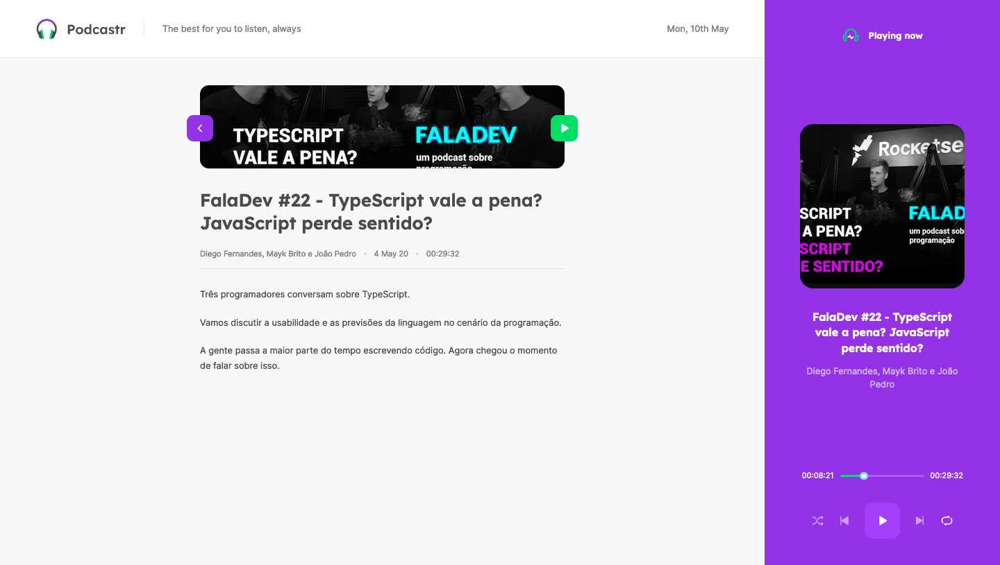

  

	
  
  
  
   
  
  

# 📖 About

Podcastr is a podcast website developed according to the course "NWL 5.0", made by [RocketSeat](rocketseat.com.br)

# 📐 Layout

  

    
  

  

    
  
 

### 🚀 Tecnologies

- React.js
- Next.js
- Typescript
- SASS
- HTML

# 🔧 How to run

- Download this project to your computer or use the git command `git clone git@github.com:marcoaminotto/podcastr.git`
- Open the folder podcastr in your system's shell
- Run `$ yarn install` to install the project's modules

### Webpage

- Open the folder podcastr in a terminal tab
- Run `$ yarn dev`

### Server

- Open the folder podcastr in a terminal tab
- Run `$ yarn server`

# :closed_book: License

Released in 2021 :closed_book: License

This project is under the [MIT license](./LICENSE).

Give a ⭐️ if this project helped you!

#

   <b> &#60;/&#62; by <a href="https://www.linkedin.com/in/marco-echevestre/">Marco Echevestre</a></b>

